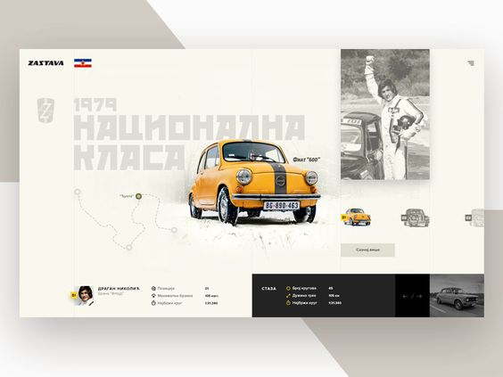
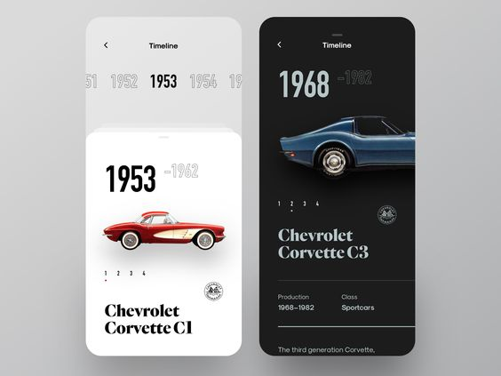

# SOUL VOLKS
Al momento l'idea è quella di una landing page per l'evento
---
## Descrizione:
Landing page con una bella foto di una macchina in primo piano.
 Dietro la scritta (1966 (?) -> 2024) (la scritta si trasforma dopo il caricamento del DOM)
 Scorrendo verso il basso troviamo sezione di descrizione dell'evento, quindi:
  giorno1 : musica cibi esibizioni
  giorno2 : musica cibi esibizioni
  giorno3 : musica cibi esibizioni
 Data e luogo (countdown???)(mappa???)
 Contatti ? modulo contatti ? 
 Sponsor obbligatorio nel footer

### Linguaggi, librerie e framework utilizzati:
- HTML, CSS, JavaScript
- Bootstrap, JQuery
- PostgreSQL (eventuale uso di database?)
- AJAX
---
### Proprietà:
- Alessandro Paolantonio
---
### Server:
- Aruba Hosting Easy Linux
- SiteGround GrowBig
---
### Implementazioni da effettuare post coding:
- Aggiornamenti Server e database regolari -> effettuati da Aruba
- Firewall e misure di sicurezza del server a livello di rete
- Certificati SSL/TLS -> strumenti per criptare connessione client-server
#### Intervento utente:
- Validazione dell'Input e Sanitizzazione (prevenire attacchi come SQL Injection e XSS)
- Gestione delle sessioni e dei cookies
- Configurazione dei firewall del server (configurare manualmente le regole del firewall per limitare l'accesso alle porte necessarie e bloccare le richieste sospette)
- Policy di Sicurezza (definire e implementare le policy di sicurezza per le password, l'accesso agli account e le procedure di backup)
- Auditing e Monitoraggio (strumenti di monitoraggio e log per individuare attività sospette)
- Gestione delle vulnerabilità (applicare patch di sicurezza)
---
### Istruzioni installazione:
> installazione di XAMPP e PostgreSQL

Download PostgreSQL da [qui](https://www.enterprisedb.com/downloads/postgres-postgresql-downloads)

Download XAMPP da [qui](https://www.apachefriends.org/it/download.html)
---
### Estensioni Visual Studio Code utili: 
- HTML CSS Support
- JavaScript (ES6) code snippets
- PHP Intelephense
- Live Preview
- GitHub Pull Requests
---

#### Link a Pinterest con idee:
[Idea 1](https://it.pinterest.com/pin/858498747748191629/)
[Idea 2](https://it.pinterest.com/pin/85216617944168475/)

--- 
### FOTO IDEE UI:

---
### Possibili sviluppi:
- Traduzione multilingue del sito (almeno italiano e inglese)
- Login e area personale per abbonati
- Collegamento a ticketone per vendita biglietti evento